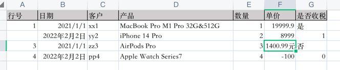
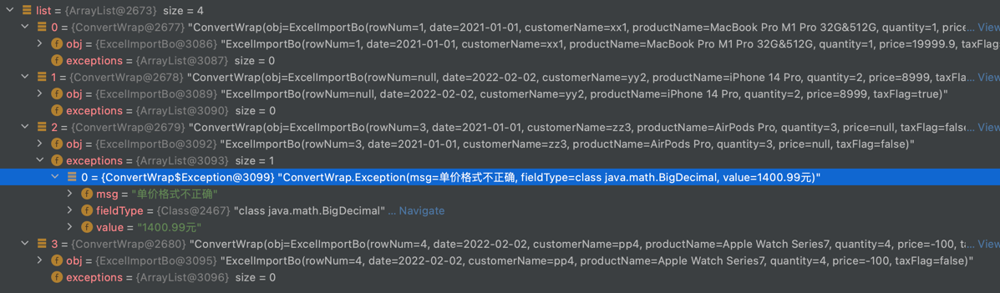

# easyexcel-read-convert

在easyexcel基础上进行一些工具类编写，能够做到直接将读取出来的数据转换成具体的不同类型的字段，如BigDecimal类型或者LocalDate类型等...

## 使用方法

1. 给目标对象的字段上使用@Converter指定类型转换器
```java
@Data
public class ExcelImportBo {

    @ExcelProperty(value = "行号", index = 0)
    @Converter(value = IntegerFieldConverter.class, errorMsg = "行号格式不正确")
    private Integer rowNum;

    @ExcelProperty(value = "日期", index = 1)
    @Converter(value = LocalDateFieldConverter.class, errorMsg = "无法识别日期格式")
    @NotNull(message = "请填入日期")
    private LocalDate date;
}
```

如果没有可用的转换器可以自定义的去实现`ExcelFieldConverter`接口

2. 使用通用的Listener`CommonEasyExcelListener`
```java
public class CommonEasyExcelListenerTest{
    
    @Test
    public void Test() {
        // 读取数据
        List<ConvertWrap<ExcelImportBo>> list = new ArrayList<>();

        EasyExcel
                .read(
                        CommonEasyExcelListenerTest.class.getResourceAsStream("/test.xlsx"),
                        // 使用通用的Listener
                        new CommonEasyExcelListener<>(ExcelImportBo.class, list::add)
                )
                .headRowNumber(1)
                .sheet()
                .doRead();

        for (ConvertWrap<ExcelImportBo> convertWrap : list) {
            String validMsg = ValidatorUtils.validate2Str(convertWrap.getObj());
            System.out.println(StrUtil.format("读取内容: {}, 校验信息: {}", convertWrap, validMsg));
        }
    }

}
```

## 测试结果



```text
读取内容: ConvertWrap(obj=ExcelImportBo(rowNum=1, date=2021-01-01, customerName=xx1, productName=MacBook Pro M1 Pro 32G&512G, quantity=1, price=19999.9, taxFlag=true), exceptions=[]), 校验信息: [单价不能超过10000]
读取内容: ConvertWrap(obj=ExcelImportBo(rowNum=null, date=2022-02-02, customerName=yy2, productName=iPhone 14 Pro, quantity=2, price=8999, taxFlag=true), exceptions=[]), 校验信息:
读取内容: ConvertWrap(obj=ExcelImportBo(rowNum=3, date=2021-01-01, customerName=zz3, productName=AirPods Pro, quantity=3, price=null, taxFlag=false), exceptions=[ConvertWrap.Exception(msg=单价格式不正确, fieldType=class java.math.BigDecimal, value=1400.99元)]), 校验信息: [请填入单价]
读取内容: ConvertWrap(obj=ExcelImportBo(rowNum=4, date=2022-02-02, customerName=pp4, productName=Apple Watch Series7, quantity=4, price=-100, taxFlag=false), exceptions=[]), 校验信息: [单价必须大于0]
```
